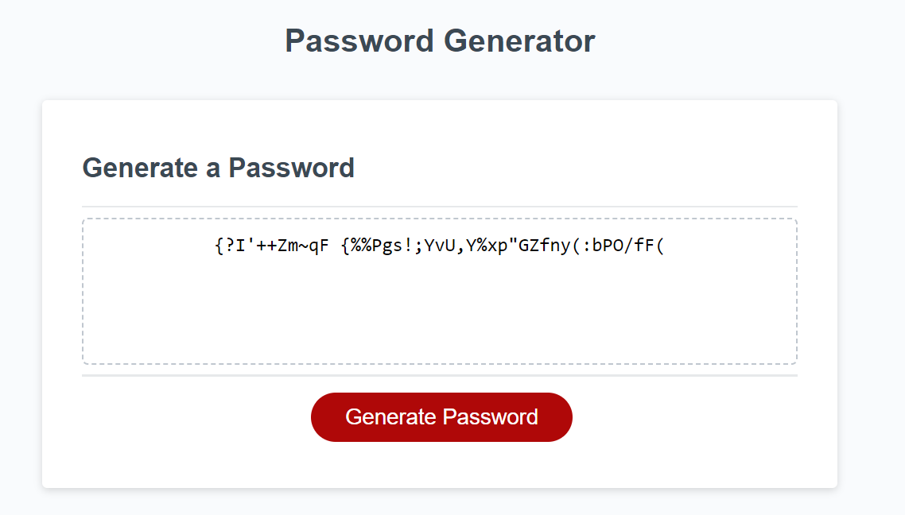

# Custom Password Generator
Bootcamp homework week 3. Come see it at [https://hannahrajarao.github.io/bootcamp-hw-3-password-generator/](https://hannahrajarao.github.io/bootcamp-hw-3-password-generator/)
Steps to use:
1. Click "Generate password" button
2. Enter desired password length
3. Answer prompts about types of characters to use (OK for yes, Cancel for no)  

